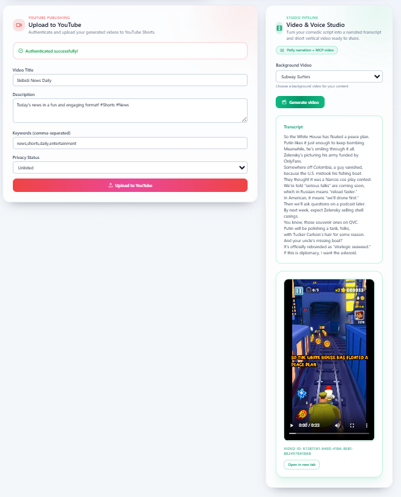

# Skibidi News

Turning daily news into short, funny, watchable bites powered by a fleet of MCP services.




## Highlights

- Fully modular MCP pipeline: news aggregation, humorization, prompt optimization, and text-to-video.
- Router Agent (FastAPI) exposes a single HTTP API for the frontend and proxies every MCP call.
- Docker Compose stack for one-command bringup plus standalone module workflows for rapid iteration.
- Prompt optimizer keeps humor quality consistent via Elo tournaments and reusable prompt packs.

For the deep dive, see `docs/ARCHITECTURE.md` (big picture) and `docs/COMPONENT_GUIDE.md` (code map).

## Architecture at a Glance

| Component        | Responsibility                                                                                     | Key Path                 |
| ---------------- | -------------------------------------------------------------------------------------------------- | ------------------------ |
| Router Agent     | FastAPI server that orchestrates MCP calls and serves assets to the frontend.                      | `router_agent/src`       |
| News Aggregator  | Fetches fresh headlines per category and builds a 100-word professional digest.                    | `mcp_news_aggr/`         |
| Humorizer        | Rewrites summaries into comedic scripts using OpenAI/Anthropic or deterministic fallback.          | `mcp_humorizer/`         |
| Prompt Optimizer | Stores prompt packs, runs quick Elo tournaments, and surfaces the best prompt to the router.       | `mcp_prompt_opt/`        |
| Text-to-Video    | Generates transcripts, calls AWS Polly, overlays captions on background clips, and uploads Shorts. | `mcp_text_to_video/`     |
| Frontend         | Vite + React UI for selecting categories, generating stories, and previewing clips.                | `skibidi-news-frontend/` |

More implementation context lives in `docs/COMPONENT_GUIDE.md`.

## Repository Map

| Path                     | Description                                                                        |
| ------------------------ | ---------------------------------------------------------------------------------- |
| `compose.yaml`           | Docker Compose definition for the router, frontend, and every MCP service.         |
| `router_agent/`          | FastAPI router + MCP client helpers.                                               |
| `mcp_news_aggr/`         | News fetching, summarization logic, and MCP server entrypoint.                     |
| `mcp_humorizer/`         | Humor engine, deterministic fallback, and MCP tooling.                             |
| `mcp_prompt_opt/`        | Prompt library, optimizer, and FastMCP server.                                     |
| `mcp_text_to_video/`     | Transcript LLM calls, AWS Polly synthesis, video compositor, and YouTube uploader. |
| `skibidi-news-frontend/` | Web client.                                                                        |
| `docs/`                  | Architecture, component guide, deployment guide, runbook, and repomix dump.        |

## Getting Started

### Requirements

- Docker 24+ with Compose plugin (preferred path) or Python 3.10+ / Node 20+ for manual runs.
- OpenAI API key plus AWS Polly credentials (see `docs/DEPLOYMENT.md`).

### Environment Setup

1. Copy `.env.example` files in each MCP folder to `.env` and fill in required keys.
2. Export shared variables (OpenAI, AWS) in a repo-root `.env` so Compose can read them.

```
OPENAI_API_KEY=sk-...
MODEL_PROVIDER=openai
HUMOR_STYLE=light
AWS_ACCESS_KEY_ID=...
AWS_SECRET_ACCESS_KEY=...
AWS_REGION=eu-west-1
```

### One-Command Stack

```bash
docker compose up --build
```

- Router API: `http://127.0.0.1:8000`
- Frontend: `http://127.0.0.1:5173`
- Generated videos land in `finished_videos/`; the router serves them via `GET /videos/{id}`.

### Iterating on a Single Service

1. Stop the corresponding container.
2. Run the module locally (e.g., `python -m mcp_humorizer.mcp_server`).
3. Point the router to the local MCP endpoint (see service README for exact command).

Refer to `docs/DEPLOYMENT.md` for more Docker tricks and hybrid workflows.

## Operations & Runbook

- Manual API flow, smoke tests, troubleshooting cheatsheet, and incident response live in `docs/RUNBOOK.md`.
- For day-to-day diary entries or experiments, use `diary.md`.

## Team & Ownership

- **Gabi** — News Aggregation → Summarized text.
- **Vien** — Summarized text → Comedic text.
- **Roni** — Comedic text → Transcript → Audio.
- **Aarni** — Router agent, orchestration, and policies.
- **Esa** — Prompt optimization and video pipeline.

Responsibilities line up with MCP services so releases can stay independent.

## Reference Docs & Planning

- `docs/ARCHITECTURE.md` — system overview and diagrams.
- `docs/COMPONENT_GUIDE.md` — code-focused component map and data contracts.
- `docs/DEPLOYMENT.md` — docker-compose bringup and environment matrix.
- `docs/RUNBOOK.md` — operational procedures and troubleshooting.
- [Planning Whiteboard](https://excalidraw.com/#room=d46c315fa785495794e0,P0k_98fYWU7qJUFfmorItA)

Happy Skibidi-ing!
