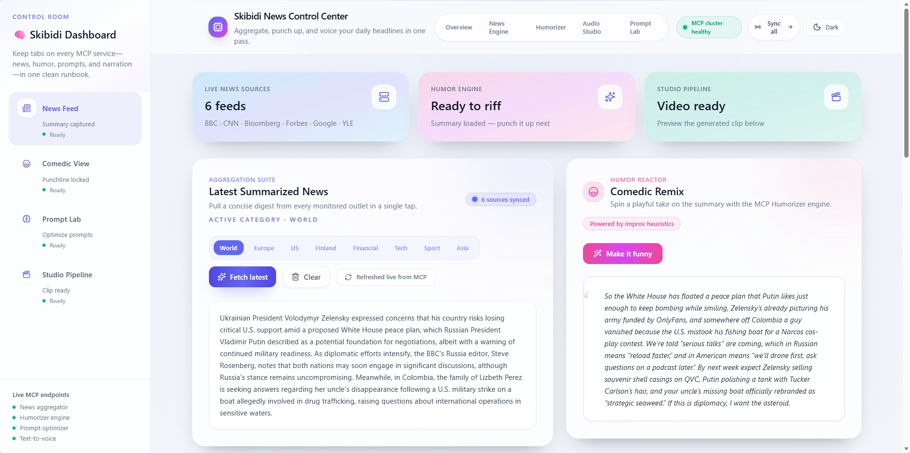

# Skibidi News

Turning daily news into short, funny, and watchable bites.

## 1) What is this?

Skibidi News is a modular, agentic pipeline that:

1. Aggregates real news.
2. Summarizes it.
3. Punches it up with humor.
4. Converts it to speech.
5. (Optionally) turns speech + captions into short video.

Each step is an **MCP (Model Context Protocol) server** that can be swapped or scaled independently. A central **Router Agent** orchestrates the flow based on a user/system prompt.

## 2) Team & Responsibilities

1. **Gabi** — _News Aggregation → Summarized Text_
2. **Vien** — _Summarized Text → Comedic Text_
3. **Roni** — _Comedic Text → Transcript → Audio_
4. **Aarni** — _Router Agent (MCP client), orchestration & policies_
5. **Esa** — _Prompt Optimization_ and _Comedic Text + Audio → Transcript → Video_

> These map 1:1 to MCP services/components so ownership is clear and deploys can be independent.

## 3) High-level Architecture

- **Router Agent (MCP client)**: Receives the user prompt + systemt (tone/constraints). Chooses which MCP service(s) to call, merges results, and pushes outputs downstream.
- **MCP Servers** (swappable micro-services):

  - `mcp-news-aggr` (Owner: **Gabi**): crawl/ingest → clustered topics → summarized text.
  - `mcp-humorizer` (Owner: **Vien**): summary → comedic rewrite (safe-mode, persona knobs).
  - `mcp-tts` (Owner: **Roni**): comedic text → transcript (final) → audio (TTS) with SSML.
  - `mcp-video` (Owner: **Esa**): comedic text + audio → transcript alignment → short video (subtitles, b‑roll, memes).
  - `mcp-prompt-opt` (Owner: **Esa**): prompt library + A/B testing + tracing feedback.

All services speak MCP over stdio/HTTP and return typed JSON payloads.

## 4) Planning and notes

[whiteboard](https://excalidraw.com/#room=d46c315fa785495794e0,P0k_98fYWU7qJUFfmorItA)

## 5) Running the app

- first add all the .env files based on the .env.example files to each mcp-server direcotry
- from the root dir run docker compose up --build
- wait for results to appear in the synthesized_speech directory
